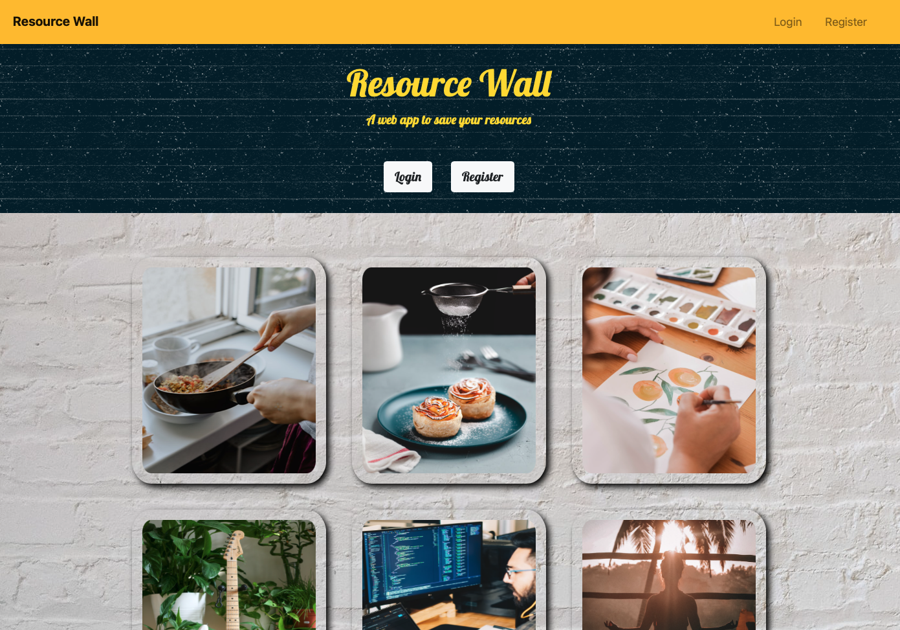
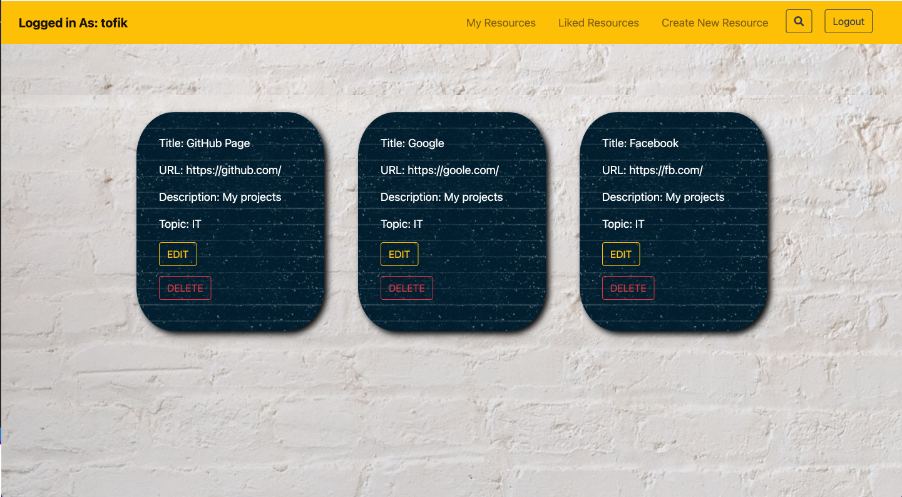
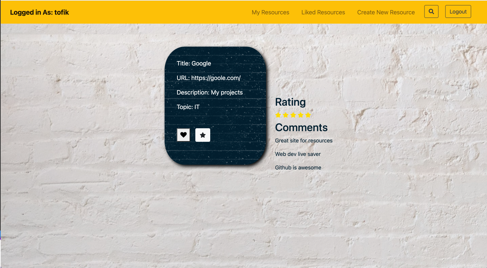
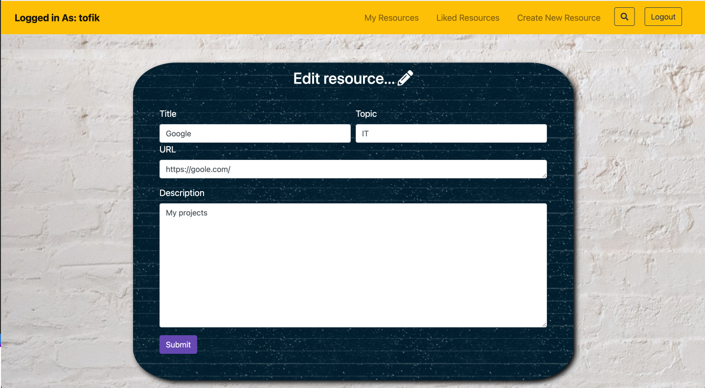

Resource Wall
A web app to save your resources
=========
This full stack webapp is built so that you could save any of your resources into it, as a user you can register and login. any user can comment or rate a resource and other users can see the average rating as well as the comment made by other users.

# Home-page

# Resource-Page

# Add resource-Page

## Getting Started

1. Create the `.env` by using `.env.example` as a reference: `cp .env.example .env`
2. Update the .env file with your correct local information

- username: `labber`
- password: `labber`
- database: `midterm`

3. Install dependencies: `npm i`
4. Fix to binaries for sass: `npm rebuild node-sass`
5. Reset database: `npm run db:reset`

- Check the db folder to see what gets created and seeded in the SDB

7. Run the server: `npm run local`

- Note: nodemon is used, so you should not have to restart your server

8. Visit `http://localhost:8080/`

## Tech-Stack

<code></code>
<code></code>
<code></code>
<code></code>
<code></code>

## Dependencies

- Node 10.x or above
- NPM 5.x or above
- PG 6.x
